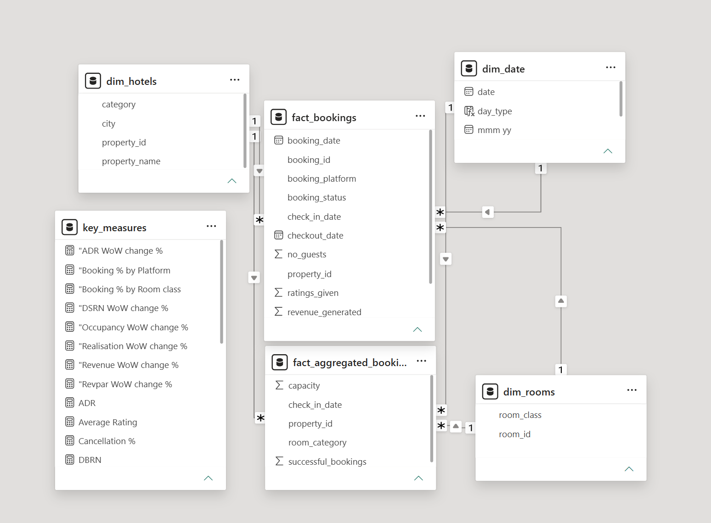

# AtliQ Hospitality Analysis using PowerBI

This repository contains a business intelligence project developed for AtliQ Grands, a chain of five star hotels in India. The project was completed as part of the Codebasics September Resume Challenge. It uses PowerBI to analyze historical hotel data and provide actionable insights to help AtliQ Grands regain market share and improve revenue in the luxury and business hotel categories.

## Table of Contents

* 📝 [Project Overview](#project-overview-)
* 📊 [Dashboard Preview](#dashboard-preview-)
* 📈 [Metrics & Insights](#metrics--insights-)
* 🎓 [Key Learnings](#key-learnings-)
* 💬 [Connect with Me](#connect-with-me-)

## Project Overview 📝

AtliQ Grands hired a third party service provider (me) to analyze their historical data and generate insights. The dashboard created in PowerBI focuses on key metrics like revenue, occupancy rates, cancellation rates, and more to support data driven decision making.

## Dashboard Preview 📊

Here are some visuals of the developed dashboard:

**Overall Analysis View**

**Monthly Analysis View**

**Data Model**

## Metrics & Insights 📈

Key metrics include:

* Revenue
* Occupancy Rate
* Cancellation Rate
* Hotel Ratings
* RevPAR & ADR

Key Insights

- **Total revenue** across the reporting period was **₹1.71bn**, with an overall occupancy rate of **57.87%** and an average rating of **3.62**.

- **Luxury category properties** drive the majority of revenue (**61.61%**), compared to **38.39%** from Business category properties.

- **Atliq Exotica (Mumbai)** is the top-performing property, generating **₹118.4M** in revenue with a **4.32** average rating and **65.92%** occupancy.

- The **weakest-performing properties** are spread across different metrics rather than one property:
  - **Atliq Grands (Delhi)** has the lowest revenue (**₹36.1M**).
  - **Atliq Seasons (Mumbai)** has the lowest average rating (**2.29**).
  - **Atliq Grands (Bangalore)** has the lowest occupancy (**44.4%**).

- **Weekend performance** consistently outpaces weekdays across **RevPAR, occupancy, and ADR**.

- **Cancellation rate** holds steady at around **24.8%** across the full period.

- In the **most recent week of data**, occupancy dropped roughly **17% week-over-week**, while ADR stayed essentially flat (**+0.2%**), pointing to a **dip in demand rather than a pricing issue**.

## Key Learnings 🎓

* Built a calendar visual using a matrix table.
* Gained insights into hotel cancellation policies and their revenue impact.
* Used bookmarks and page navigation to switch between Overall and Monthly analysis views.

## Connect with Me 💬

* 📫 Email: [thanyamanivannan@gmail.com](mailto:thanyamanivannan@gmail.com)
* 🔗 LinkedIn: [linkedin.com/in/thanyamanivannan](https://www.linkedin.com/in/thanyamanivannan/)
